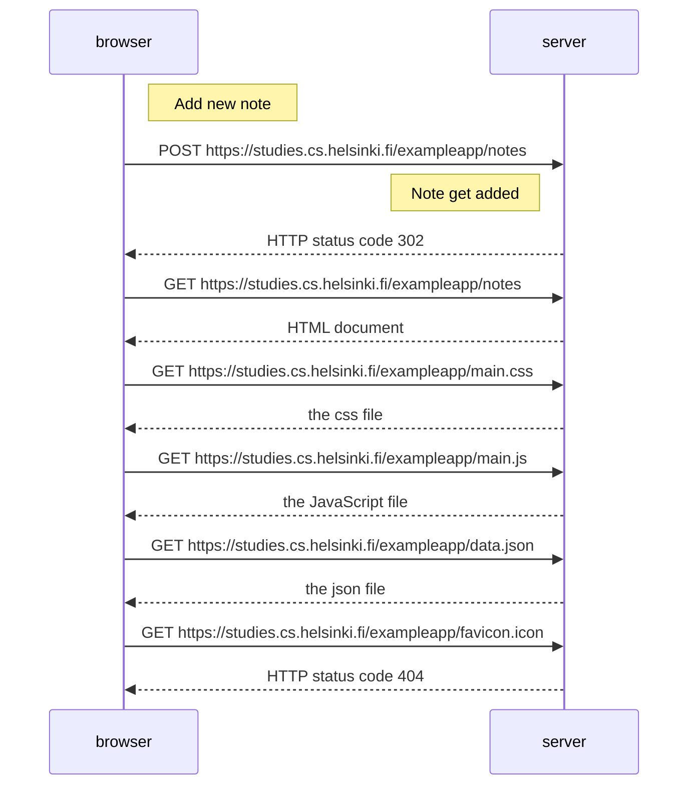

```mermaid
 sequenceDiagram
    participant browser
    participant server

    Note right of browser: Add new note
    browser->>server: POST https://studies.cs.helsinki.fi/exampleapp/notes
    Note left of server: Note get added 
    server-->>browser: HTTP status code 302

    browser->>server: GET https://studies.cs.helsinki.fi/exampleapp/notes
    server-->>browser: HTML document

    browser->>server: GET https://studies.cs.helsinki.fi/exampleapp/main.css
    server-->>browser: the css file

    browser->>server: GET https://studies.cs.helsinki.fi/exampleapp/main.js
    server-->>browser: the JavaScript file

    browser->>server: GET https://studies.cs.helsinki.fi/exampleapp/data.json
    server-->>browser: the json file

    browser->>server: GET https://studies.cs.helsinki.fi/exampleapp/favicon.icon
    server-->>browser: HTTP status code 404
```
