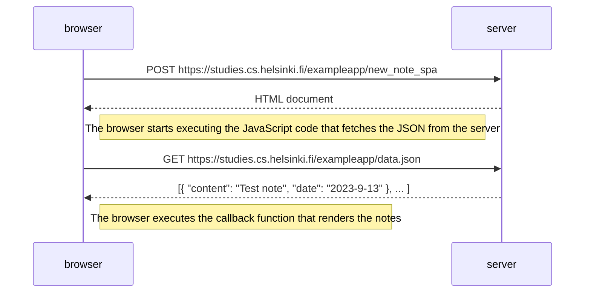

```mermaid
 sequenceDiagram
    participant browser
    participant server

    browser->>server: POST https://studies.cs.helsinki.fi/exampleapp/new_note_spa
    server-->>browser: HTML document

    Note right of browser: The browser starts executing the JavaScript code that fetches the JSON from the server   
    browser->>server: GET https://studies.cs.helsinki.fi/exampleapp/data.json
    server-->>browser: [{ "content": "Test note", "date": "2023-9-13" }, ... ]
    Note right of browser: The browser executes the callback function that renders the notes
```
